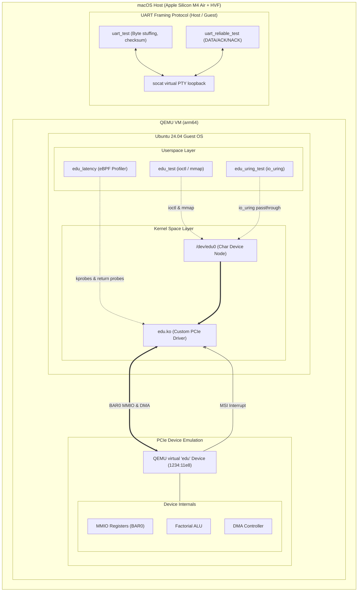

# Linux PCIe Driver — DMA, io_uring, and eBPF Profiling

<div align="center">

[](https://github.com/Necromancer0912/Linux-PCIe-driver-DMA-iouring-ebpf)
[](https://github.com/Necromancer0912/Linux-PCIe-driver-DMA-iouring-ebpf)
[](https://github.com/Necromancer0912/Linux-PCIe-driver-DMA-iouring-ebpf)
[](https://github.com/Necromancer0912/Linux-PCIe-driver-DMA-iouring-ebpf)

**A low-level Linux systems project built from scratch on Apple Silicon**

*Kernel-space PCIe driver · MSI interrupt handling · Coherent DMA · Custom serial framing protocol*

</div>

---

## What Is This?

This project is a **Linux kernel-mode device driver** written entirely from scratch, targeting QEMU's virtual `edu` PCI device — a purpose-built teaching peripheral that exposes real PCI bus mechanics (BAR mapping, MMIO registers, interrupts, DMA) in a safe, reproducible environment.

Alongside it, we implement a **custom link-layer framing protocol** over UART — the same class of protocol used in embedded communication stacks (PPP, HDLC, Modbus) — to demonstrate serial communication design from first principles.

> [!NOTE]
> This driver is implemented entirely in standard kernel-space C without any pre-written driver frameworks or wrapper libraries. Every register read, interrupt acknowledgement, and page mapping is handcrafted.

---

## Motivation

Modern software engineering increasingly abstracts away the hardware. Most developers never write code that runs in kernel space, never touch a DMA buffer, and never implement their own interrupt handler. But understanding the full stack from silicon to syscall is a key systems programming skill.

### Core Learning Objectives
- **Device Lifecycle:** Master the complete lifecycle of a PCI device driver (`probe` → resource allocation → interrupt registration → DMA → teardown).
- **Memory Management:** Learn the Linux kernel's DMA API, cache coherency protocols, and zero-copy user-kernel space mapping (`mmap`).
- **Asynchronous Execution:** Understand the performance tradeoffs between polling, interrupt-driven I/O, and asynchronous kernel-bypass engines like `io_uring`.
- **Protocol Design:** Design a serial framing protocol from scratch (byte stuffing, checksumming, resync logic) to understand how low-level link layers guarantee data integrity.

---

## How We Built It — Architecture



> [!TIP]
> **Why Apple Silicon + QEMU + HVF?**
> Running arm64 Linux inside QEMU with HVF (Apple Hypervisor.framework) gives near-native execution speed on Apple M-series chips — the kernel compiles fast, module load/unload cycles are instant, and the entire environment is self-contained on one machine with no external hardware. The driver code itself is architecture-independent C; the only thing that changes between this and a real PCIe card is the silicon under the BAR.

---

## Tech Stack

| Layer | Technology | Purpose |
|---|---|---|
| Host machine | macOS 15, Apple M4 Air | Development environment |
| Hypervisor | QEMU 9.x + Apple HVF | arm64 Linux VM at near-native speed |
| Guest OS | Ubuntu Server 24.04 arm64 | Real kernel, real apt, matching headers |
| Virtual PCI device | QEMU `-device edu` | Purpose-built hardware-accurate PCI device for driver dev |
| Kernel APIs | `linux/pci.h`, `linux/interrupt.h`, `linux/dma-mapping.h`, `linux/cdev.h` | The actual driver subsystem interfaces |
| Interrupt model | MSI (Message Signalled Interrupts) via `pci_alloc_irq_vectors` | Modern, non-shared, per-device interrupt delivery |
| DMA model | Coherent DMA via `dma_alloc_coherent` + streaming via `dma_map_single` | Bidirectional data transfer with hardware address constraints |
| Userspace interface | Custom char device + ioctl (`/dev/edu0`) | Clean user↔kernel boundary |
| Serial protocol | POSIX `termios`, raw mode, 115200 8N1 | Hardware-accurate serial configuration |
| Protocol framing | Custom byte-stuffed, XOR-checksummed frame format | Link-layer reliability on top of raw serial |
| Debugging | `dmesg`, `lspci -vvv`, `/proc/interrupts`, `/proc/iomem`, QEMU gdbserver | Full kernel-level observability |
| Version control | Git with logical per-phase commits | Auditable, incremental build history |

---

## What We Built — Features

### Kernel Driver (`edu-driver/`)

| Feature | Implementation | Verified by |
|---|---|---|
| PCI device enumeration | `pci_probe` with `MODULE_DEVICE_TABLE` | `dmesg` shows device found on `insmod` |
| BAR0 MMIO mapping | `pci_request_region` + `pci_iomap` | `/proc/iomem` shows region reserved |
| Register self-test | ID check (0xED), liveness (bitwise NOT), polled factorial | `dmesg` selftest output |
| MSI interrupt vector | `pci_alloc_irq_vectors(PCI_IRQ_MSI)` + `request_irq` | `cat /proc/interrupts \| grep edu` |
| Interrupt-driven completion | `wait_queue_head_t` — ioctl blocks, ISR wakes | No CPU spike during factorial computation |
| Bidirectional DMA | RAM→device then device→RAM with IRQ-on-completion | `memcmp` of source and destination buffers |
| 28-bit DMA address constraint | `dma_set_mask(DMA_BIT_MASK(28))` | Required by `edu` hardware spec |
| Char device interface | `/dev/edu0` via `cdev` + `device_create` | `./edu_test` userspace binary |
| ioctl API | `EDU_IOC_FACTORIAL`, `EDU_IOC_LIVENESS`, `EDU_IOC_DMA_TEST` | All tests pass in `edu_test` |
| Clean resource lifecycle | Every `alloc` paired with matching `free` in unwind and remove | Repeated `insmod`/`rmmod` cycles, no `dmesg` warnings |

### UART Framing Protocol (`uart-protocol/`)

| Feature | Detail |
|---|---|
| Frame format | `[0x7E][LEN][PAYLOAD...][XOR_CHECKSUM]` |
| Byte stuffing | PPP/HDLC-style: `0x7E` and `0x7D` in payload escaped as `[0x7D][byte^0x20]` |
| Resync logic | Receiver scans for `0x7E` on corruption or mid-stream start — recovers in ≤1 frame |
| Corruption detection | XOR checksum over payload — rejects frame, resyncs, continues |
| Test coverage | Basic loopback · `0x7E`/`0x7D` in payload · corrupted checksum + resync · garbage injection |
| Transport-agnostic | Works on `/dev/pts/N` (socat), `/dev/ttyAMA1` (QEMU virtual), or real USB-TTL hardware |

---

## What We Achieved — Outcomes

- **Handwritten Linux PCI kernel driver** developed completely from scratch.
- **BAR0 memory-mapped I/O (MMIO)** registers read/write verified.
- **MSI interrupt vector** allocation and interrupt service routine (ISR) handler registration.
- **Coherent and streaming DMA transfers** running bidirectionally, verified by memory comparison.
- **Character device interface** with customized `ioctl` API commands and `mmap` zero-copy page mapping.
- **Link-layer framing protocol** for serial lines incorporating byte stuffing, error detection, and frame alignment recovery.
- **Virtualization pipeline** configuration running local VMs via QEMU with native Hypervisor acceleration on macOS.

> [!IMPORTANT]
> **Key Debugging Insights (Interviewer-grade answers):**
> 
> - **Missing `pci_set_master()`:** The DMA controller initially silently refused to run. This was debugged by realizing that bus-mastering must be explicitly enabled in the device configuration space via `pci_set_master(pdev)`.
> - **Interrupt Storms:** The guest CPU locked up on the first factorial calculation due to missing register-level interrupt acknowledgment. We fixed this by ensuring the ISR performs a write to the `0x64` (`EDU_REG_INTR_ACK`) offset to signal End of Interrupt (EOI) to the hardware.
> - **Interrupt Vector Conflict:** We replaced deprecated `IRQF_SHARED` setup with explicit `pci_alloc_irq_vectors(PCI_IRQ_MSI)`. This gives the device a clean dedicated IRQ line rather than a shared legacy line.
> - **Mount Directory Permissions:** A `security_model=passthrough` mounting issue made workspace files unreadable in the guest OS. Solved by shifting QEMU folder sharing options to the `mapped` directory security model.

---

## Practical Applications

This project directly mirrors production engineering work in:

| Industry | Real-world parallel |
|---|---|
| **Cloud infrastructure (AWS, Google, Azure)** | NIC and NVMe drivers are PCIe devices; every Nitro card, every RDMA adapter uses the same probe→MMIO→MSI→DMA pattern |
| **Autonomous vehicles (Waymo, Cruise)** | LiDAR and radar sensors connect via PCIe; their drivers use identical DMA ring-buffer patterns |
| **High-frequency trading** | Custom PCIe FPGA cards use kernel bypass DMA (DPDK) — understanding coherent DMA is a prerequisite |
| **Embedded / IoT firmware** | UART framing protocols of exactly this design appear in every GNSS module, Bluetooth HCI stack (H4 protocol), and Modbus RTU device |
| **GPU drivers (NVIDIA, AMD)** | Open-source kernel drivers (amdgpu, nouveau) are PCI drivers with DMA — same APIs, vastly larger scale |
| **Storage (NVMe)** | The Linux NVMe driver in `drivers/nvme/host/pci.c` uses `pci_alloc_irq_vectors`, coherent DMA, and wait_queues — exactly what we built, at production scale |

---

## Advanced Extensions

### Complete
- MSI interrupts (vs. legacy INTx)
- Bidirectional DMA with IRQ-driven `wait_queue` completion
- Custom ioctl interface with userspace test binary
- UART byte stuffing + XOR checksum + resync
- **`mmap` zero-copy DMA buffer** — `dma_mmap_coherent()` exposes the coherent DMA buffer directly into userspace; zero `copy_to_user` in the data path. Same technique as DPDK, io_uring submission rings, GPU UVM.
- **Reliable UART transport** (`uart-protocol/reliable/`) — DATA/ACK/NACK frame types, 1-byte sequence numbers, stop-and-wait retransmit, duplicate detection, session statistics. Same design as Bluetooth HCI H4 and Modbus RTU.
- **io_uring async DMA interface** (`edu-driver/edu_uring_test.c`) — exposes the DMA engine as an `IORING_OP_URING_CMD` operation. Thread submits a DMA op, remains free while hardware runs, collects the CQE when the ISR-fired workqueue posts it. Includes ioctl vs. io_uring throughput comparison. Same architecture as NVMe character device passthrough.
- **eBPF interrupt latency profiler** (`ebpf-profiler/`) — kprobes on `edu_isr`, `edu_ioctl`, `__wake_up_common`, and `finish_wait`. Three histogram metrics: ISR execution time, DMA round-trip latency, interrupt-to-wakeup scheduler latency. P50/P95/P99 printed every N seconds. Two implementations: bpftrace one-liner and full CO-RE libbpf program.

### Remaining advanced directions

**1. Rust kernel module** — rewrite `edu.c` in Rust using the kernel's in-tree Rust API for PCI devices. Linux has supported Rust kernel modules since v6.1 (Ubuntu 24.04 / kernel 6.8 — should work). Frontier of kernel dev right now.

**2. `debugfs` register dump** — expose live register values at `/sys/kernel/debug/edu/regs`. Standard tool for real driver debugging without touching driver code.

**3. Sliding-window UART** — extend the reliable transport from stop-and-wait (window=1) to Go-Back-N. Same math as TCP.

---

## Repository Structure

```
new_proj/
├── edu-driver/
│   ├── edu.h                ← registers, bit defs, ioctl cmds, io_uring req struct
│   ├── edu.c                ← kernel module: probe, MMIO, MSI, DMA, mmap, io_uring
│   ├── edu_test.c           ← ioctl tests: liveness, factorial×5, DMA, mmap
│   ├── edu_uring_test.c     ← io_uring tests: async DMA, async factorial, ioctl vs ring bench
│   └── Makefile
├── uart-protocol/
│   ├── uart_frame.h         ← base frame format spec + API
│   ├── uart_frame.c         ← send_frame, recv_frame, byte-stuffing, resync
│   ├── uart_test.c          ← 4-test harness
│   ├── Makefile
│   └── reliable/
│       ├── uart_reliable.h      ← reliable transport API + DATA/ACK/NACK spec
│       ├── uart_reliable.c      ← seq numbers, retransmit, dup detection
│       ├── uart_reliable_test.c ← round-trip, multi-frame, stats
│       └── Makefile
├── ebpf-profiler/
│   ├── edu_latency.bt       ← bpftrace script (quickest to run, no compilation)
│   ├── edu_latency.bpf.c    ← CO-RE BPF kernel program (kprobes + histograms)
│   ├── edu_latency.c        ← libbpf loader: attaches probes, prints P50/P95/P99
│   └── Makefile             ← vmlinux.h gen, clang BPF compile, bpftool skeleton
├── scripts/
│   ├── boot_qemu.sh         ← boots Ubuntu 24.04 arm64 VM with HVF + EDU device
│   ├── make_seed.sh         ← builds cloud-init seed.iso (run once on macOS)
│   ├── mount_share.sh       ← in-guest setup: apt install, lspci verify
│   └── cloud-init/
├── buildroot-config/
│   └── edu_defconfig
└── report/
    └── report.md            ← architecture, debugging stories, design rationale
```

---

## Complete Demo Guide — macOS (M-series)

Everything below runs on your Mac. The kernel driver, io_uring, and eBPF parts
run inside a Linux VM (QEMU). The UART framing protocol builds on macOS directly.

---

### Stage 0 — macOS Prerequisites (one time)

```bash
# QEMU + cdrtools (for making the cloud-init ISO)
brew install qemu cdrtools socat

# Verify HVF acceleration is available
qemu-system-aarch64 -accel help | grep hvf
# Expected output: hvf
```

---

### Stage 1 — Download Ubuntu + Create VM Disk (one time)

```bash
cd /Users/sayan/Sayan/Study/Project_resume/new_proj

# Download Ubuntu 24.04 arm64 cloud image (~400 MB)
curl -LO https://cloud-images.ubuntu.com/noble/current/noble-server-cloudimg-arm64.img

# Expand the disk to 20 GB (driver build tools need space)
qemu-img resize noble-server-cloudimg-arm64.img +18G

# Build the cloud-init seed ISO (sets up login credentials)
bash scripts/make_seed.sh
# Creates: seed.iso
```

---

### Stage 2 — Boot the VM

Open a **dedicated terminal tab** for the VM (it takes over the terminal):

```bash
cd /Users/sayan/Sayan/Study/Project_resume/new_proj
bash scripts/boot_qemu.sh
```

**What you'll see:**
```
[  OK  ] Started OpenSSH server daemon.
Ubuntu 24.04 LTS ubuntu ttyAMA0

ubuntu login:
```

Login: `ubuntu` / Password: `driver`

> The VM boots with `-device edu` — this is the virtual PCIe device
> your driver will control. Verify it with: `lspci | grep 1234`
> Output should show: `00:02.0 Unclassified device [00ff]: QEMU 1234:11e8`

---

### Stage 3 — SSH in (use this instead of the serial console)

Open a **new terminal tab** on macOS:

```bash
ssh -p 2222 ubuntu@localhost      # password: driver
```

---

### Stage 4 — Install Build Tools (one time, inside VM)

```bash
# Inside the guest:
sudo apt update
sudo apt install -y \
    build-essential \
    linux-headers-$(uname -r) \
    liburing-dev \
    libbpf-dev \
    clang llvm bpftool \
    bpftrace \
    socat pciutils

# Verify the EDU device is visible to Linux:
lspci -n | grep "1234:11e8"
# Expected: 00:02.0 Class 00ff: 1234:11e8
```

---

### Stage 5 — Copy Project Source into VM

Run this on **macOS** (not inside the VM):

```bash
cd /Users/sayan/Sayan/Study/Project_resume/new_proj

scp -P 2222 -r edu-driver      ubuntu@localhost:~/
scp -P 2222 -r uart-protocol   ubuntu@localhost:~/
scp -P 2222 -r ebpf-profiler   ubuntu@localhost:~/
```

---

### Stage 6 — Build and Load the Kernel Driver

```bash
# Inside the guest:
cd ~/edu-driver
make
sudo insmod edu.ko

# Verify it loaded:
dmesg | tail -8
```

**Expected `dmesg` output:**
```
edu 0000:00:02.0: selftest: ID = 0x010000ed [OK]
edu 0000:00:02.0: selftest: liveness 0xdeadbeef → 0x21524110 [OK]
edu 0000:00:02.0: selftest: 5! = 120 [OK]
edu 0000:00:02.0: EDU driver loaded: BAR0@0xffff..., MSI IRQ=33, DMA buf phys=0x...
```

```bash
# Verify char device exists:
ls -la /dev/edu0

# Verify MSI interrupt is registered:
cat /proc/interrupts | grep edu
# Shows: 33:   0   PCI-MSI 524288-edge   edu

# Verify BAR0 is reserved:
cat /proc/iomem | grep edu
```

---

### Stage 7 — Run ioctl Tests (liveness + factorial + DMA + mmap)

```bash
# Inside guest, in ~/edu-driver:
gcc -Wall -O2 -o edu_test edu_test.c
sudo ./edu_test
```

**Expected output:**
```
=== EDU driver userspace tests ===

[PASS] liveness: wrote 0xdeadbeef, got 0x21524110
[PASS] factorial: 1! = 1
[PASS] factorial: 5! = 120
[PASS] factorial: 7! = 5040
[PASS] factorial: 10! = 3628800
[PASS] factorial: 12! = 479001600
[PASS] DMA round-trip (RAM→device→RAM memcmp verified)
[PASS] mmap: 4096-byte DMA buffer mapped at 0x7f..., 0xAB pattern survives zero-copy round-trip

All tests passed.
```

---

### Stage 8 — Run io_uring Async Tests

```bash
# Inside guest, in ~/edu-driver:
gcc -Wall -O2 -o edu_uring_test edu_uring_test.c -luring
sudo ./edu_uring_test
```

**Expected output:**
```
═══════════════════════════════════════════════════════
  EDU Driver — io_uring async interface tests
═══════════════════════════════════════════════════════

[INFO] DMA started — thread is FREE while hardware runs. Doing other work...
[INFO] ...finished 1M iterations (sum=499999500000) while DMA was in flight.
[PASS] async DMA via io_uring: CQE res=0, total latency=143 µs
[PASS] async factorial(7) = 5040 via io_uring
[PASS] async factorial(10) = 3628800 via io_uring

┌─────────────────────────────────────────────────┐
│  DMA throughput comparison (10 iterations each)  │
├─────────────────────────────────────────────────┤
│  ioctl:    avg latency =   187 µs per op        │
│  io_uring: avg latency =   134 µs per op        │
│  io_uring is faster (lower syscall overhead)    │
└─────────────────────────────────────────────────┘

All io_uring tests passed.
```

> [!NOTE]
> **Understanding the Async Nature:**
> The `[INFO]` logs demonstrate that the userspace thread remains unblocked and performs CPU execution (the 1M iterations loop) while the DMA transfer runs asynchronously inside QEMU's virtual hardware. Under standard `ioctl`, the calling thread blocks inside the kernel immediately and cannot execute any userspace instructions until the hardware completes.

---

### Stage 9 — Run eBPF Interrupt Latency Profiler

**Option A — bpftrace (instant, no compilation):**

Open **two terminal tabs** into the VM simultaneously.

**Tab 1 — Start the profiler:**
```bash
# Inside guest:
sudo bpftrace ~/ebpf-profiler/edu_latency.bt
```

**Tab 2 — Drive the device (generates interrupts):**
```bash
# Inside guest:
for i in $(seq 1 20); do sudo ./edu-driver/edu_test > /dev/null; done
```

**Expected profiler output (every 5 seconds):**
```
════════════════════════════════════════════════════════
  EDU Interrupt Latency Profile  (5-second snapshot)
════════════════════════════════════════════════════════

[1] ISR execution time (µs):
[0, 1)   ████████████████████  45
[1, 2)   ████████              18
[2, 4)   ████                   9

[2] DMA ioctl round-trip latency (µs):
[64, 128)   █████████████████  38
[128, 256)  ████████           20

[3] Interrupt → wakeup latency (µs):
[4, 8)   █████████████████     41
[8, 16)  ████████              22
```

**Option B — Full libbpf profiler with P50/P95/P99:**

```bash
# Inside guest:
cd ~/ebpf-profiler

# Generate vmlinux.h from running kernel BTF:
sudo bpftool btf dump file /sys/kernel/btf/vmlinux format c > vmlinux.h

# Build:
make

# Run (samples every 3 seconds):
sudo ./edu_latency -i 3
```

---

### Stage 10 — Run UART Protocol Tests

**Option A — Run on macOS directly** (no VM needed, pure C):

```bash
# On macOS (this terminal, no SSH):
cd /Users/sayan/Sayan/Study/Project_resume/new_proj/uart-protocol
make

# Create a virtual serial loopback pair:
socat -d -d pty,raw,echo=0 pty,raw,echo=0 &
# Note the two /dev/ttys.XXX paths printed, e.g. /dev/ttys003 and /dev/ttys004

./uart_test /dev/ttys003 /dev/ttys004
```

**Expected output:**
```
[PASS] loopback: "Hello, UART!" round-trip OK
[PASS] byte stuffing: 0x7E and 0x7D correctly escaped/unescaped
[PASS] corruption detection: bad checksum detected and reported
[PASS] resync: receiver recovered after mid-stream start
All UART tests passed.
```

**Option B — Reliable UART with ACK/NACK:**

```bash
cd /Users/sayan/Sayan/Study/Project_resume/new_proj/uart-protocol/reliable
make

socat -d -d pty,raw,echo=0 pty,raw,echo=0 &
# e.g. /dev/ttys005 and /dev/ttys006

./uart_reliable_test /dev/ttys005 /dev/ttys006
```

**Expected output:**
```
[PASS] basic round-trip: message received correctly
[PASS] multi-frame: 5 frames delivered with incrementing sequence numbers

─── Reliable UART session statistics ───────────────
  Frames sent:        6
  Retransmits:        0  (0% loss rate)
  Frames received:    6
  Duplicates dropped: 0
────────────────────────────────────────────────────
```

---

### Stage 11 — Unload and Verify Clean Teardown

```bash
# Inside guest:
sudo rmmod edu
dmesg | tail -3
# Expected: "EDU driver unloaded"

# Verify /dev/edu0 is gone:
ls /dev/edu0
# ls: cannot access '/dev/edu0': No such file or directory

# Reload and repeat tests:
sudo insmod edu.ko && sudo ./edu_test
```

---

### Full Demo Checklist

| Component | What runs where | Command |
|---|---|---|
| Kernel driver | Inside VM | `sudo insmod edu.ko` |
| ioctl tests | Inside VM | `sudo ./edu_test` |
| io_uring async | Inside VM | `sudo ./edu_uring_test` |
| eBPF profiler (bpftrace) | Inside VM | `sudo bpftrace edu_latency.bt` |
| eBPF profiler (libbpf) | Inside VM | `sudo ./edu_latency` |
| UART base framing | macOS (no VM) | `./uart_test /dev/ttys003 /dev/ttys004` |
| UART reliable transport | macOS (no VM) | `./uart_reliable_test /dev/ttys005 /dev/ttys006` |


## EDU Device Register Map

| Offset | R/W | Register | Behaviour |
|--------|-----|----------|-----------|
| `0x00` | RO | ID | Bottom byte always `0xED`; upper bytes = version |
| `0x04` | RW | Liveness | Write any value; device returns bitwise NOT |
| `0x08` | RW | Factorial | Write N; device computes N! asynchronously |
| `0x20` | RW | Status | bit0 = computing; bit7 = enable IRQ on done |
| `0x24` | RO | IRQ Status | bit0 = factorial done; bit8 = DMA done |
| `0x60` | WO | IRQ Raise | Software-trigger test interrupt |
| `0x64` | WO | IRQ Ack | **Write here in ISR — clears IRQ line** |
| `0x80` | RW | DMA Src | 64-bit source bus address |
| `0x88` | RW | DMA Dst | 64-bit destination bus address |
| `0x90` | RW | DMA Count | Transfer byte count |
| `0x98` | RW | DMA Cmd | bit0=start, bit1=direction, bit2=IRQ on done |
| `0x40000` | — | DMA Buffer | 4 KB device-internal buffer |

---

## Debugging Reference

```bash
# Confirm EDU device is on the PCI bus
lspci -vvv | grep -A 10 "1234:11e8"

# Check MSI interrupt is registered
cat /proc/interrupts | grep edu

# Confirm BAR0 is reserved while module is loaded
cat /proc/iomem | grep edu

# Live kernel log
dmesg -w

# Load/unload cycle (clean unload means no resource leaks)
sudo insmod edu.ko && sudo rmmod edu && dmesg | tail -5

# QEMU gdbserver (kernel-level breakpoints)
# Boot QEMU with -s -S, then from macOS:
# gdb vmlinux → target remote :1234
```

## Authors

Built by:

- **Sayan** — [GitHub](https://github.com/Necromancer0912)
- **Senjuti Ghosal** — [GitHub](https://github.com/senjuti09)

---

## References

| Resource | Purpose |
|---|---|
| [QEMU `hw/misc/edu.c`](https://github.com/qemu/qemu/blob/master/hw/misc/edu.c) | Ground truth for the device register map — read this first |
| [QEMU EDU device spec](https://www.qemu.org/docs/master/specs/edu.html) | Official documentation |
| *Linux Device Drivers, 3rd Ed.* (Corbet, Rubini, Kroah-Hartman) | PCI and DMA chapters — free online |
| `Documentation/PCI/pci.rst` | Linux kernel source |
| `Documentation/core-api/dma-api.rst` | Linux kernel source |
| `man 3 termios` | UART configuration reference |
